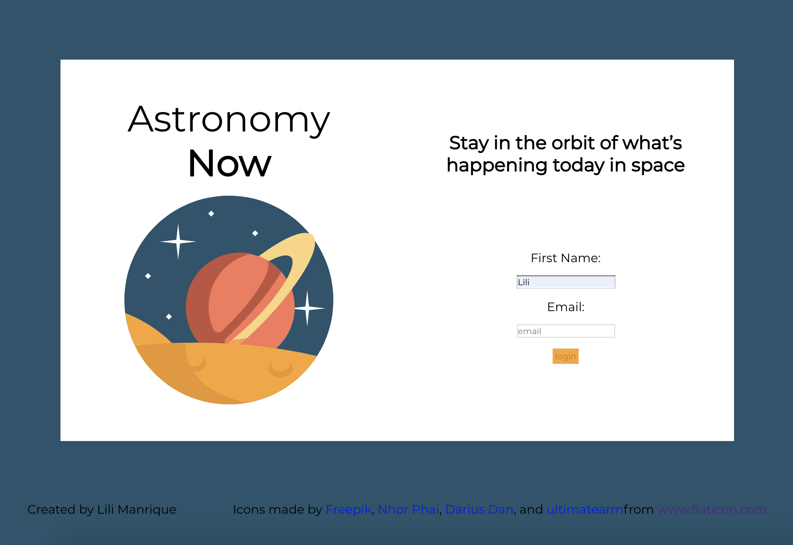

## Project Overview

[GH Pages Deployed Link](https://lmanriq.github.io/astronomy-now/)

Astronomy Now is a website for amateur astronomers who want to keep track of current events in space. It allows users to see the NASA astronomy photo of the day and the Mars Curiosity Rover photos from the past four days on one page. Rover photos can be added to favorites and clicked on to be expanded. On the ISS tracking page, it shows them a map that updates every five seconds to show the location of the ISS. Users can also look up when the ISS will pass over them and see how many people are in space on a given day. In the news section, users can read articles from the Hubble Telescope and favorite those as well. 

## Technologies used

Languages/Frameworks
- JavaScript
- React.js
- Redux
- React Router
- React Testing Library/Jest

External APIs
- [NASA (Astronomy POTD and Mars Rover)](https://api.nasa.gov/)
- [Hubblesite](http://hubblesite.org/api/documentation)
- [Open Notify](http://open-notify.org/Open-Notify-API/)
- [Leaflet](https://react-leaflet.js.org/)
- [React Modal](https://www.npmjs.com/package/react-modal)
- [Moment.js](https://momentjs.com/)

## Screenshots

This project was bootstrapped with [Create React App](https://github.com/facebook/create-react-app).

